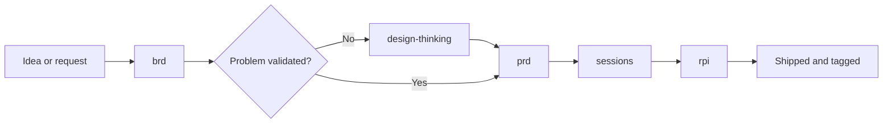

## Overview

Reusable GitHub Copilot skills for AI-native engineering. Each skill is a
self-contained markdown package that works on its own and composes with the
others, covering the path from business case to discovery, requirements, and
delivery.

The skills are owned, reviewed, and versioned here. They draw on published
patterns but do not depend on any framework at runtime.

`new-method` is a placeholder. This effort does not have an agreed name yet, and
`context-first` is a separate effort whose name we do not own. See
[Naming](docs/design.md#naming).

## Skills in This Repository

| Skill | Responsibility | Location |
|-------|----------------|----------|
| `brd` | Builds a business requirements document from notes, covering objectives, measures, scope, and risks | [skills/brd/SKILL.md](skills/brd/SKILL.md) |
| `design-thinking` | Validates the real problem before anything is built, and hands off evidence-backed requirements | [skills/design-thinking/SKILL.md](skills/design-thinking/SKILL.md) |
| `prd` | Builds a PRD from stream-of-consciousness notes, with cited provenance and an explicit gap list | [skills/prd/SKILL.md](skills/prd/SKILL.md) |
| `rpi` | Research, Plan, Implement, Review inner loop, with per-phase constraints and artifacts | [skills/rpi/SKILL.md](skills/rpi/SKILL.md) |
| `sessions` | Session outer loop: frame, fit check, and close ritual ending in a tagged release | [skills/sessions/SKILL.md](skills/sessions/SKILL.md) |

Bundled assets:

| Asset | Used by |
|-------|---------|
| [brd-template.md](skills/brd/assets/brd-template.md) | `brd` output structure |
| [session-log-template.md](skills/sessions/assets/session-log-template.md) | `sessions` close ritual and health signals |
| [prd-template.md](skills/prd/assets/prd-template.md) | `prd` output structure, including deliberate underspecification |

## How They Fit Together

Start at the skill that owns the next real decision. A bounded engineering task
needs only `rpi`. A settled requirement needs `sessions` and `rpi`. An
ambiguous customer request starts further left.

## Documentation

| Document | Contents |
|----------|----------|
| [CHANGELOG.md](CHANGELOG.md) | Released versions and what changed in each |
| [AGENTS.md](AGENTS.md) | Repository memory: settled decisions and conventions for AI assistants working here |
| [docs/design.md](docs/design.md) | Distribution decision and rationale, target architecture, installation with `gh skill`, the skill update policy, and delivery status |
| [docs/training-brief.md](docs/training-brief.md) | Raw stakeholder request for Copilot training offerings, pending a BRD |

## License

MIT. See [LICENSE](LICENSE).
