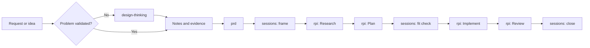

## Approach

We distribute with `gh skill`, the first-party GitHub CLI command for agent
skills, which is the same mechanism
[Awesome Copilot](https://github.com/github/awesome-copilot) uses to distribute
its catalog. This is a choice of plumbing, not a dependency on a catalog or a
framework. Skills are markdown packages that install into a repository, so teams
can reuse published skills, edit them, and author their own on the same footing.
That authorability is the point: a skill someone cannot change is a framework
with extra steps.

Like [HVE Core](https://github.com/microsoft/hve-core), we subscribe to Design
Thinking and RPI. We implement both differently. HVE Core targets a chat-centric
workflow, while these skills target agents, so each phase carries its own
constraints and produces its own artifacts rather than running as a sequence of
chat prompts.

PRDs and BRDs are not novel. They are used frequently across AI-assisted software
engineering, and they are included here because requirements work is where most
delivery failures start. The variation worth noting is that both are built from
written notes with cited provenance, rather than assembled through an interview.

`sessions` came out of our experience working with GSIs and enterprise customers.
The recurring problem there was not generation speed. It was work that never
closed: scope drift, unmerged branches, and every session starting cold.

## Why the GitHub CLI and a Plain Repository

The customization and version control arguments for installing into the
repository are made in [Install Skills In the
Repository](#install-skills-in-the-repository). The reasons to carry the skills
over the GitHub CLI, rather than a package registry or an editor extension, are
separate and worth stating on their own, because they are what makes this
approach survive contact with an enterprise.

* Plumbing the customer already has. `gh` is authenticated against the session
  the developer is already signed into. It works against private and
  internal repositories and honors SSO and SAML the way every other GitHub
  operation does. There is no new credential for a security team to review and
  no registry account to provision. For GSI and enterprise delivery, "it uses
  the GitHub CLI you are already logged into" clears procurement in a way that a
  new package feed does not.
* No registry to operate. No service to run, no uptime to own, no account that
  has to be transferred when someone changes teams. A repository and a tag are
  the entire distribution system.
* The files are the artifact. No build step, no lockfile format, no runtime.
  What a reviewer approves in a pull request is byte for byte what lands in the
  consuming repository's `.agents/skills` directory. That is what lets this
  document claim a choice of plumbing rather than a dependency, and the claim is
  checkable: no `SKILL.md` here refers to `gh skill`, to a profile, or to any
  installation mechanism at all. Content and distribution stay separable, and a
  team that decides to copy the folders in by hand loses nothing.
* Git already provides the hard parts. Immutable refs, signed tags, blame, diff,
  revert, branch protection, required reviews, and CODEOWNERS all apply without
  being reimplemented. A skill change is reviewed on the same gate as a code
  change because it is a code change.
* Nothing we ship executes on the consumer's machine. We ship markdown and a
  tag. There is no install hook, no post-install script, and no installer of
  ours to review, because `gh skill` does the fetching and writing. That is a
  materially different threat model from a package manager that runs
  publisher-authored code, and the consumer's audit question is answerable by
  reading a diff.

## Naming

This effort needs a name and does not have one yet. Treat every occurrence of
`new-method` in this repository as a placeholder to be replaced once the name is
settled.

Constraints:

* HVE is not available. That team retains the HVE name and charter.
* `context-first` is a candidate, but it is currently a separate effort. Adopting
  it now would conflate two things that are not yet the same thing, and would
  claim a name we do not own.

The name reaches further than a rename usually implies. It appears in the
repository name, the plugin identity, the install commands we publish, document
titles, and any course material that references them. Settling it early costs
less than settling it after the first delivery.

Attribution is separate from naming. Credits that reference `context-first` or
HVE Core cite the source of a methodology and stay as they are regardless of what
this effort ends up being called.

## Install Skills In the Repository

Skills belong inside the repository they serve, not in a user-level or
extension-managed location outside it. HVE Core installs outside the repository,
and we take the opposite position deliberately.

In-repo installation gives a team two things it otherwise gives up:

* Customization. A skill in the repository can be edited to match how this team
  actually works. A skill installed elsewhere is read-only in practice, so local
  knowledge accumulates outside the workflow instead of inside it.
* Version control. The team decides when a skill changes, reviews the diff, and
  ships it with the code it governs. An externally managed skill can change
  underneath a repository without a commit, which makes behavior unreproducible
  across machines and over time.

The practical test is whether checking out an old commit reproduces the workflow
that was in force at the time. That only holds when the skills live with the code.

## Use Language-Scoped Instructions

GitHub Copilot applies instructions by file pattern, so guidance can attach to
`*.go`, `*.ts`, `*.cs`, or any other glob. That capability is distinctive and
underused, and it should be both taught and used in what we build.

It matters because scoping changes what the model sees. Language guidance that
loads only when a matching file is open keeps context focused, and it lets a
polyglot repository carry conventions per language without one set of standards
bleeding into another.

HVE Core does ship language-specific content. Our read is that much of it is
dated and verbose for current models, which are stronger at idiomatic code than
they were when that material was written. The useful content is the part a model
still gets wrong without being told: local conventions, house style, and the
specific traps in this codebase. Write that and leave out the general language
tutorial.

## Composition

Every skill is optional, and each one is useful on its own. Skills may use other
skills:

| Skill | Uses | Standalone behavior |
|-------|------|---------------------|
| `sessions` | `rpi` for the inner loop | Falls back to inline per-phase prompts |
| `prd` | Discovery output when it exists | Drafts from whatever notes are available |
| `design-thinking` | Nothing | Hands off notes and evidence |
| `brd` | Nothing | Drafts from stakeholder notes |
| `rpi` | Nothing | Runs a single task end to end |

No skill requires another to be installed. Install the one that owns the next
decision and add others when they earn their place.

The set preserves the workflow controls that matter: evidence-based research,
explicit acceptance criteria, scoped implementation, independent review, durable
records, and clear follow-up routing.

> [!IMPORTANT]
> Source artifacts are owned, reviewed, versioned, and validated by our team.
> HVE Core is a reference for patterns, not an installation dependency or a
> runtime requirement.

## Target Architecture



Discovery stays a separate install from the session loop until evidence shows
every team needs it. That keeps bounded engineering work low-friction while
giving ambiguous customer work an explicit route.

See the [skills catalog](../README.md#skills-in-this-repository) for what exists today.

## Planned Artifacts

| Artifact | Responsibility | Planned form |
|----------|----------------|--------------|
| `new-method` plugin | Groups the maintained skills for installation | `plugins/new-method/plugin.json` |
| Release tags | Give consumers something to pin with `--pin` | Signed `0.x.y` tags plus a changelog |

## Installing With gh skill

`gh skill` is a first-party GitHub CLI command, in public preview and requiring
GitHub CLI v2.90.0 or later. It installs, previews, lists, updates, and
publishes agent skills. `gh skills` is an accepted alias.

We do not ship an installer. An earlier version of this plan specified a
repository-owned Bash and PowerShell installer with its own allowlist, manifest,
and verification flags. `gh skill` covers that surface, and a first-party
command a customer's security team already trusts beats a script of ours that
does the same job.

This repository is already discoverable as-is. `gh skill` finds skills by the
`skills/*/SKILL.md` convention from the [Agent Skills
specification](https://agentskills.io/specification), which is the layout these
five skills already use, bundled `assets/` directories included. No repackaging,
no build step, and no release asset is required.

### Installing

```bash
# one skill, pinned
gh skill install <owner>/<repo> rpi --pin 0.2.0

# the whole set
gh skill install <owner>/<repo> --all --pin 0.2.0

# read it before installing anything
gh skill preview <owner>/<repo> rpi

# what is installed here now
gh skill list
```

Pin every install. Without `@version` or `--pin`, the command resolves to the
latest tagged release and falls back to the default branch when no tag exists,
so an unpinned install against an untagged repository silently takes whatever
is on the branch. `skill@0.2.0` and `--pin 0.2.0` are equivalent, and both
accept a tag or a commit SHA.

### Placement

The default scope is `project`, which installs inside the current repository.
That is the position argued in [Install Skills In the
Repository](#install-skills-in-the-repository), and it is the default we want,
so the flag usually does not need to be passed at all. `--scope user` installs
to the home directory instead and gives up the reproducibility argument.

At project scope, GitHub Copilot and most other supported agents share the
`.agents/skills` directory, so one install serves a mixed-tool team rather than
one per agent. `--agent` selects a host explicitly and `--dir` overrides
placement entirely.

Commit what lands. The install is only reproducible if the installed files are
in the repository's history alongside the code they govern.

### Profiles

Profiles are a documentation convention here, not a flag. `gh skill install`
takes skill names, so a profile is the set of names a situation calls for.

| Profile | Skills | Intended use |
|---------|--------|--------------|
| `rpi` | `rpi` | A single non-trivial task, without the session loop |
| `session` | `sessions`, `rpi`, `prd` | Engineering teams with settled requirements |
| `discovery` | `design-thinking`, `brd`, `prd` | Customer discovery, workshops, and ambiguous requests |
| `full` | All five | Discovery that continues into delivery |
| `governed` | `full` plus organization-approved instructions | Teams that require prescribed engineering or security standards |

```bash
gh skill install <owner>/<repo> sessions rpi prd --pin 0.2.0   # session profile
```

Install the profile that owns the next decision rather than `full`. Every
unused skill is more context to disambiguate against, which costs triggering
accuracy rather than adding capability.

## Updating Installed Skills

In-repo installation buys customization and reproducibility, and it pays for
both with drift. A skill a team can edit is a skill that will diverge from
upstream. That is the intended trade, not a defect, but it only stays a good
trade if updating is a defined ritual rather than an overwrite.

Treat installed skills as vendored, not subscribed. Nothing updates on its own,
and no update lands without a diff someone read.

### Release Contract

Consumers can only pin to what we publish, so the publishing side comes first.

* Tags are immutable. A wrong `0.2.0` is fixed by `0.2.1`, never by moving the
  tag. Consumers pin to tags and `gh skill` records the tree SHA it installed,
  so a moved tag makes every downstream install unreproducible.
* Version the skill set, not each skill. Patch is wording, minor is a new skill
  or a new optional step, major is a renamed skill, a moved path, or a changed
  template structure.
* Skill directory names under `skills/` are the public API. They are what
  `gh skill install <owner>/<repo> <name>` resolves against, so renaming or
  moving one breaks every pinned install command in circulation.
* Sign release tags. It is the answer when a customer asks how they know the
  skill they installed is the one we published.
* Keep a changelog that names which sections of a skill changed, not only which
  files. A team that edited a skill locally needs to know what to re-read.

### Update Cadence

Update on project milestones, not on a calendar. An automatic weekly bump
changes agent behavior mid-session, which is the same unreproducibility we
reject for externally managed installs.

| Trigger | Action |
|---------|--------|
| Start of a project or engagement | `gh skill install` the current release, pinned |
| Between phases, such as discovery closing and delivery opening | Update if the profile needs to change |
| A `sessions` close where a skill visibly misfired | Update, or fix locally and consider upstreaming |
| A new upstream major | Read the changelog and schedule the merge deliberately |
| Mid-session, mid-cohort, or mid-release | Do not update |

Record the installed ref in the session log entry. `sessions` already ends in a
tag and a written paragraph, so adding the ref makes "which methodology version
produced this release" answerable from git alone.

### Detecting Drift

`gh skill update` compares the tree SHA recorded in each installed `SKILL.md`
frontmatter against the remote repository, so drift detection needs no manifest
of ours.

```bash
gh skill update --dry-run          # report what is stale, change nothing
```

One consequence is easy to miss: `gh skill update` deliberately skips pinned
skills. If every install is pinned, as it should be, then `--dry-run` reports
nothing and is not the signal to watch. Drive updates from our releases instead,
by watching this repository's releases and reading the changelog, then
reinstalling at the new tag.

| State | How you learn about it | Action |
|-------|------------------------|--------|
| A new release exists | Release watch and changelog, not `--dry-run` | Reinstall pinned at the new tag |
| Installed files are unmodified | `git status` on the installed paths is clean | Reinstall with `--force`, review the diff, commit |
| Installed files were edited locally | `git log` on the installed paths | Merge, per below, rather than `--force` |

Because installs are committed, git answers the drift question directly. The
installed skill has a history, and the commit that installed it cleanly is the
merge base.

### Merging Local Edits

`gh skill` has no three-way merge. `gh skill update --force` re-downloads and
overwrites locally modified files with their upstream content, which destroys
exactly the local knowledge that in-repo installation exists to capture.

Git supplies the missing piece, on the condition that each clean install is
committed on its own. That commit is the merge base.

```bash
SKILL=.agents/skills/rpi/SKILL.md
BASE=$(mktemp) LOCAL=$(mktemp)

git show <clean-install-commit>:"$SKILL" > "$BASE"   # upstream at the old pin
cp "$SKILL" "$LOCAL"                                 # our edited version

gh skill install <owner>/<repo> rpi --pin 0.2.0 --force   # upstream at the new pin
cp "$SKILL" "$BASE.new" && cp "$LOCAL" "$SKILL"

git merge-file "$SKILL" "$BASE" "$BASE.new"
```

`git merge-file <current> <base> <other>` merges in place and exits with the
conflict count, so a clean merge is silent and a conflicted one is reported.

At merge time, sort every local edit into one of two kinds:

* Project-specific. Codebase traps, house conventions, and the language-scoped
  guidance described above. These stay local permanently and are re-applied on
  every update.
* Generally useful. If several teams made the same edit, it belongs upstream.
  Open a pull request here, then drop the local change once it ships.

Skipping that sort is how a fork widens on every cycle until updating stops
being worth attempting.

### Pinning for Course Delivery

Freeze the ref for the duration of a cohort. The lab repository, the known-good
PRD, and the run sheet timings are all coupled to specific skill wording, so an
upstream update mid-course invalidates the instructor kit.

This also answers an open question in the [training
brief](training-brief.md#course-1-open-questions): whoever cuts a major version
owns refreshing the recorded and printed material, and courses pin to a tag
until that refresh ships.

## Delivery Plan

| Step | Work | Status |
|------|------|--------|
| 1 | Author the `sessions` skill and session log template | Done |
| 2 | Author the `design-thinking` discovery skill | Done |
| 3 | Author the `prd` skill and PRD template | Done |
| 4 | Author the `rpi` skill as a standalone inner loop that other skills leverage | Done |
| 5 | Author the `brd` skill and BRD template | Done |
| 6 | Cut and sign `0.1.0` and start the changelog, so there is a pinnable tag to install from | Done |
| 7 | Verify `gh skill install` against a fixture repository: discovery of all five skills, bundled assets, pinning, and `--all` | Not started |
| 8 | Verify each installed skill is discovered by GitHub Copilot from `.agents/skills` at project scope | Not started |
| 9 | Cut `0.2.0` and walk the documented update path, covering a clean reinstall and a locally modified skill merged with `git merge-file` | Not started |
| 10 | Package the artifacts as a plugin and submit through the Awesome Copilot validation and contribution workflow, or publish with `gh skill publish` as an independently versioned set | Not started |
| 11 | Pilot with one delivery team and measure time to a validated plan, implementation rework, review findings, and install success rate | Not started |
